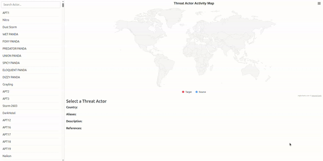

# MISP-Galaxy-Threat-Actor-JSON-UI
UI integrated with MAP for MISP-Galaxy ThreatActor

## To update Threat Actor profile
Download threat-actor.json from MISP-Galaxy/Cluster

## run below command  to load json to DB
```python
python3 manage.py import_threat_actors threat-actor.json
```

## 🎥 Demo

